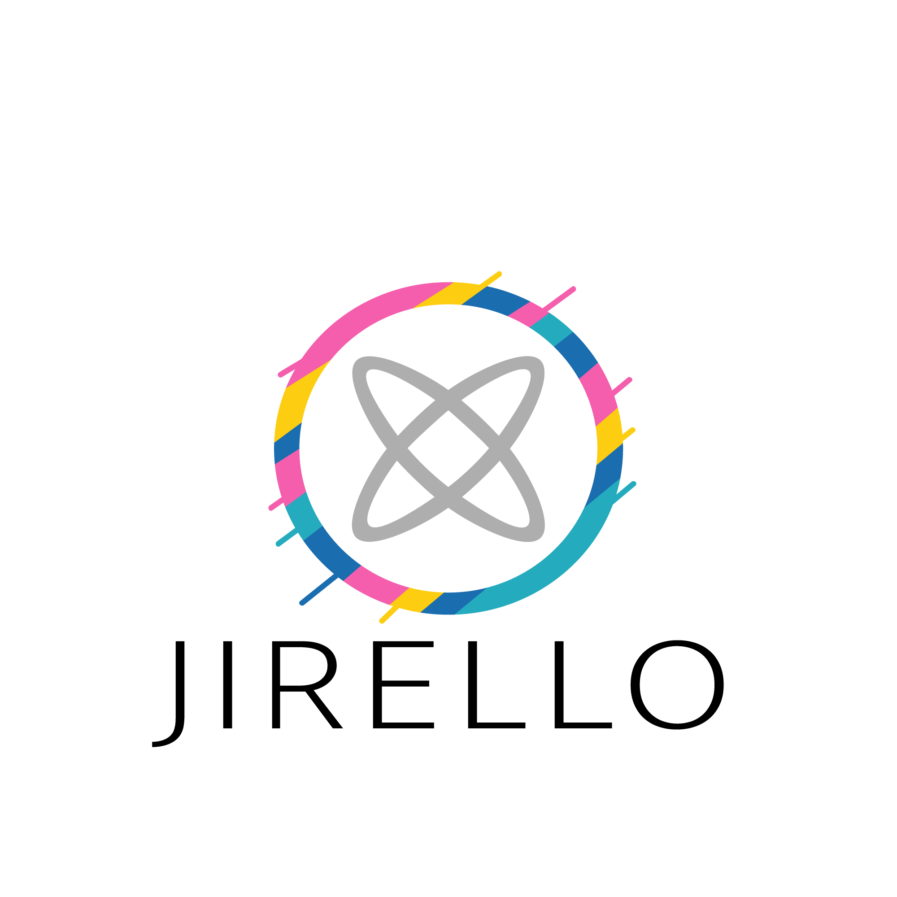

# Трелло


# trello

<!-- Improved compatibility of back to top link: See: https://github.com/othneildrew/Best-README-Template/pull/73 -->
<a name="readme-top"></a>
<!--
*** Thanks for checking out the Best-README-Template. If you have a suggestion
*** that would make this better, please fork the repo and create a pull request
*** or simply open an issue with the tag "enhancement".
*** Don't forget to give the project a star!
*** Thanks again! Now go create something AMAZING! :D
-->


<!-- PROJECT SHIELDS -->
<!--
*** I'm using markdown "reference style" links for readability.
*** Reference links are enclosed in brackets [ ] instead of parentheses ( ).
*** See the bottom of this document for the declaration of the reference variables
*** for contributors-url, forks-url, etc. This is an optional, concise syntax you may use.
*** https://www.markdownguide.org/basic-syntax/#reference-style-links
-->
[![Contributors][contributors-shield]][contributors-url]
[![Forks][forks-shield]][forks-url]
[![Stargazers][stars-shield]][stars-url]
[![Issues][issues-shield]][issues-url]
[![MIT License][license-shield]][license-url]
[![LinkedIn][linkedin-shield]][linkedin-url]


<!-- PROJECT LOGO -->
<br />
<div align="center">
  <a href="https://github.com/FeNix784/Trello">
    
  </a>

  <h3 align="center">Jirello</h3>

  <p align="center">
    Доска для Agile методологий
    <!-- <br />
    <a href="https://github.com/othneildrew/Best-README-Template"><strong>Explore the docs »</strong></a>
    <br />
    <br />
    <a href="https://github.com/othneildrew/Best-README-Template">View Demo</a>
    ·
    <a href="https://github.com/othneildrew/Best-README-Template/issues">Report Bug</a>
    ·
    <a href="https://github.com/othneildrew/Best-README-Template/issues">Request Feature</a>
  </p> -->
</div>


<!-- TABLE OF CONTENTS -->
<details>
  <summary>Table of Contents</summary>
  <ol>
    <li>
      <a href="#about-the-project">О проектеt</a>
      <ul>
        <li><a href="#built-with">Built With</a></li>
      </ul>
    </li>
    <li>
      <a href="#getting-started">Getting Started</a>
      <ul>
        <li><a href="#prerequisites">Prerequisites</a></li>
        <li><a href="#installation">Installation</a></li>
      </ul>
    </li>
    <li><a href="#usage">Usage</a></li>
    <li><a href="#roadmap">Roadmap</a></li>
    <li><a href="#contributing">Contributing</a></li>
    <li><a href="#license">License</a></li>
    <li><a href="#contact">Contact</a></li>
    <li><a href="#acknowledgments">Acknowledgments</a></li>
  </ol>
</details>


<!-- ABOUT THE PROJECT -->
## About The Project

[![Product Name Screen Shot][product-screenshot]](https://example.com)

Данный проект представляет собой программную реализацию системы, которая осуществялет гибкое управление проектами путем командного взаимодействия.

Основными гибкими методологиями принято считать Scrum и Kanban. Их целями принято считать получение готового качественного продукта вовремя.

Данный проект визуализирует процессы, чтобы они были у команды на виду. Для этого используют так называемую доску и прикрепленные к ней карточки или стикеры.

Доска является обязательным элементом гибких методологий. Каждый член команды имеет к ней доступ и видит, на каком этапе находится та или иная задача. Она содержит в себе разделы(колонки), в которых находятся карточки задач.
Карточка содержит в себе трактовку, описание, тип, исполнителей, комментарии задачи и движется по потоку перетекая в другие столбцы в зависимости от их состояния.

Главная цель проекта создать систему, которая позволит визуализировать процесс разработки, чтобы каждый участник проекта видел картину целиком и корректировал отдельные ее части, понимая, как его изменения затронут весь проект.

Use the `QUICKSTART_README.md` to get started.

<p align="right">(<a href="#readme-top">↑ Наверх</a>)</p>


### Основные технологии

В данном проекте использовались следующие технологии:

<!-- * [![Next][Next.js]][Next-url] -->
* [![React][React.js]][React-url]
* [![Vue][Vue.js]][Vue-url]
<!-- * [![Angular][Angular.io]][Angular-url]
* [![Svelte][Svelte.dev]][Svelte-url]
* [![Laravel][Laravel.com]][Laravel-url]
* [![Bootstrap][Bootstrap.com]][Bootstrap-url]
* [![JQuery][JQuery.com]][JQuery-url] -->
* [![Java][Java]][Java-url]
* [![Quarkus][Quarkus]][Quarkus-url]
* [![PostgreSQL][PostgreSQL]][PostgreSQL-url]
* [![Hibernate][hibernate]][hibernate-url]
* [![YandexID][YandexID]][YandexID-url]
* [![Lombok][Lombok]][Lombok-url]
* [![GSON][GSON]][Gson-url]
* [![H2][H2]][H2-url]
* [![Docker][docker]][docker-url]
* [![Swagger][swagger]][swagger-url]
* [![Postman][postman]][postman-url]
* [![GitHub][github]][github-url]


<p align="right">(<a href="#readme-top">↑ Наверх</a>)</p>


<!-- GETTING STARTED -->
## Быстрый старт

Чтобы запустить этот проект вам необходимо:

### Предустановочный процесс

Создать изображение содержащее базу данных путем вызова указанной команды из папки с файлом `docker-compose.yml`
* npm
  ```sh
  docker-compose up --build
  ```

### Запуск

После запуска контейнера с базой данных PostgreSQL, необходимо запустить проект

1. Get a free API Key at [https://example.com](https://example.com)
2. Clone the repo
   ```sh
   git clone https://github.com/your_username_/Project-Name.git
   ```
3. Install NPM packages
   ```sh
   npm install
   ```
4. Enter your API in `config.js`
   ```js
   const API_KEY = 'ENTER YOUR API';
   ```

<p align="right">(<a href="#readme-top">↑ Наверх</a>)</p>


<!-- USAGE EXAMPLES -->
## Usage

Use this space to show useful examples of how a project can be used. Additional screenshots, code examples and demos work well in this space. You may also link to more resources.

_For more examples, please refer to the [Documentation](https://example.com)_

<p align="right">(<a href="#readme-top">↑ Наверх</a>)</p>


<!-- ROADMAP -->
## Roadmap

- [x] Add Changelog
- [x] Add back to top links
- [ ] Add Additional Templates w/ Examples
- [ ] Add "components" document to easily copy & paste sections of the readme
- [ ] Multi-language Support
    - [ ] Chinese
    - [ ] Spanish

See the [open issues](https://github.com/othneildrew/Best-README-Template/issues) for a full list of proposed features (and known issues).

<p align="right">(<a href="#readme-top">↑ Наверх</a>)</p>


<!-- CONTRIBUTING -->
## Contributing

Contributions are what make the open source community such an amazing place to learn, inspire, and create. Any contributions you make are **greatly appreciated**.

If you have a suggestion that would make this better, please fork the repo and create a pull request. You can also simply open an issue with the tag "enhancement".
Don't forget to give the project a star! Thanks again!

1. Fork the Project
2. Create your Feature Branch (`git checkout -b feature/AmazingFeature`)
3. Commit your Changes (`git commit -m 'Add some AmazingFeature'`)
4. Push to the Branch (`git push origin feature/AmazingFeature`)
5. Open a Pull Request

<p align="right">(<a href="#readme-top">↑ Наверх</a>)</p>


<!-- LICENSE -->
## License

Distributed under the MIT License. See `LICENSE.txt` for more information.

<p align="right">(<a href="#readme-top">↑ Наверх</a>)</p>


<!-- CONTACT -->
## Authors

- [Бусуек Евгений](https://github.com/EugeneBUSUEK)
- [Гришучков Данила](https://github.com/grishuchkov)
- [Зайцев Егор](https://github.com/Papugaicheg)
- [Назаров Никита](https://github.com/luvlaceeeee)
- [Ткачев Даниил](https://github.com/FeNix784)

Project Link: [https://github.com/FeNix784/Trello](https://github.com/FeNix784/Trello)

<p align="right">(<a href="#readme-top">↑ Наверх</a>)</p>


<!-- ACKNOWLEDGMENTS -->
## Acknowledgments

Use this space to list resources you find helpful and would like to give credit to. I've included a few of my favorites to kick things off!

* [Choose an Open Source License](https://choosealicense.com)
* [GitHub Emoji Cheat Sheet](https://www.webpagefx.com/tools/emoji-cheat-sheet)
* [Malven's Flexbox Cheatsheet](https://flexbox.malven.co/)
* [Malven's Grid Cheatsheet](https://grid.malven.co/)
* [Img Shields](https://shields.io)
* [GitHub Pages](https://pages.github.com)
* [Font Awesome](https://fontawesome.com)
* [React Icons](https://react-icons.github.io/react-icons/search)

<p align="right">(<a href="#readme-top">↑ Наверх</a>)</p>


<!-- MARKDOWN LINKS & IMAGES -->
<!-- https://www.markdownguide.org/basic-syntax/#reference-style-links -->
[contributors-shield]: https://img.shields.io/github/contributors/othneildrew/Best-README-Template.svg?style=for-the-badge
[contributors-url]: https://github.com/othneildrew/Best-README-Template/graphs/contributors
[forks-shield]: https://img.shields.io/github/forks/othneildrew/Best-README-Template.svg?style=for-the-badge
[forks-url]: https://github.com/othneildrew/Best-README-Template/network/members
[stars-shield]: https://img.shields.io/github/stars/othneildrew/Best-README-Template.svg?style=for-the-badge
[stars-url]: https://github.com/othneildrew/Best-README-Template/stargazers
[issues-shield]: https://img.shields.io/github/issues/othneildrew/Best-README-Template.svg?style=for-the-badge
[issues-url]: https://github.com/othneildrew/Best-README-Template/issues
[license-shield]: https://img.shields.io/github/license/othneildrew/Best-README-Template.svg?style=for-the-badge
[license-url]: https://github.com/othneildrew/Best-README-Template/blob/master/LICENSE.txt
[linkedin-shield]: https://img.shields.io/badge/-LinkedIn-black.svg?style=for-the-badge&logo=linkedin&colorB=555
[linkedin-url]: https://linkedin.com/in/othneildrew
[product-screenshot]: images/screenshot.png
[Next.js]: https://img.shields.io/badge/next.js-000000?style=for-the-badge&logo=nextdotjs&logoColor=white
[Next-url]: https://nextjs.org/
[React.js]: https://img.shields.io/badge/React-20232A?style=for-the-badge&logo=react&logoColor=61DAFB
[React-url]: https://reactjs.org/
[Vue.js]: https://img.shields.io/badge/Vue.js-35495E?style=for-the-badge&logo=vuedotjs&logoColor=4FC08D
[Vue-url]: https://vuejs.org/
[Angular.io]: https://img.shields.io/badge/Angular-DD0031?style=for-the-badge&logo=angular&logoColor=white
[Angular-url]: https://angular.io/
[Svelte.dev]: https://img.shields.io/badge/Svelte-4A4A55?style=for-the-badge&logo=svelte&logoColor=FF3E00
[Svelte-url]: https://svelte.dev/
[Laravel.com]: https://img.shields.io/badge/Laravel-FF2D20?style=for-the-badge&logo=laravel&logoColor=white
[Laravel-url]: https://laravel.com
[Bootstrap.com]: https://img.shields.io/badge/Bootstrap-563D7C?style=for-the-badge&logo=bootstrap&logoColor=white
[Bootstrap-url]: https://getbootstrap.com
[JQuery.com]: https://img.shields.io/badge/jQuery-0769AD?style=for-the-badge&logo=jquery&logoColor=white
[JQuery-url]: https://jquery.com 
[Java]: https://img.shields.io/badge/java-%23ED8B00.svg?&style=for-the-badge&logo=java&logoColor=white
[Java-url]:https://www.java.com
[Quarkus]: images/quarkus.png
[Quarkus-url]:https://quarkus.io/
[Lombok]: images/lombok.png
[Lombok-url]:https://projectlombok.org/
[GSON]: images/google.png
[Gson-url]:https://www.sites.google.com/site/gson/gson-user-guide
[YandexID]: images/ya_id_.png
[YandexID-url]:https://yandex.ru/dev/id/doc/ru/
[PostgreSQL]: https://img.shields.io/badge/postgres-%23316192.svg?&style=for-the-badge&logo=postgresql&logoColor=white
[PostgreSQL-url]:https://www.postgresql.org/
[H2]: images/H2_logo.png
[H2-url]: https://ru.wikipedia.org/wiki/H2
[docker]: https://img.shields.io/badge/docker%20-%230db7ed.svg?&style=for-the-badge&logo=docker&logoColor=white
[docker-url]:https://www.docker.com/
[swagger]: images/swagger.png
[swagger-url]:https://swagger.io/
[postman]: images/postman.png
[postman-url]:https://www.postman.com/
[github]: https://img.shields.io/badge/github%20-%23121011.svg?&style=for-the-badge&logo=github&logoColor=white
[github-url]:https://github.com/
[hibernate]: images/hibernate.png
[hibernate-url]:https://hibernate.org/

This project uses Quarkus, the Supersonic Subatomic Java Framework.

If you want to learn more about Quarkus, please visit its website: https://quarkus.io/ .

## Running the application in dev mode

You can run your application in dev mode that enables live coding using:

```shell script
./mvnw compile quarkus:dev
```

> **_NOTE:_**  Quarkus now ships with a Dev UI, which is available in dev mode only at http://localhost:8080/q/dev/.

## Packaging and running the application

The application can be packaged using:

```shell script
./mvnw package
```

It produces the `quarkus-run.jar` file in the `target/quarkus-app/` directory.
Be aware that it’s not an _über-jar_ as the dependencies are copied into the `target/quarkus-app/lib/` directory.

The application is now runnable using `java -jar target/quarkus-app/quarkus-run.jar`.

If you want to build an _über-jar_, execute the following command:

```shell script
./mvnw package -Dquarkus.package.type=uber-jar
```

The application, packaged as an _über-jar_, is now runnable using `java -jar target/*-runner.jar`.

## Creating a native executable

You can create a native executable using:

```shell script
./mvnw package -Pnative
```

Or, if you don't have GraalVM installed, you can run the native executable build in a container using:

```shell script
./mvnw package -Pnative -Dquarkus.native.container-build=true
```

You can then execute your native executable with: `./target/trello-1.0-SNAPSHOT-runner`

If you want to learn more about building native executables, please consult https://quarkus.io/guides/maven-tooling.

## Related Guides

- Hibernate ORM ([guide](https://quarkus.io/guides/hibernate-orm)): Define your persistent model with Hibernate ORM and
  JPA
- RESTEasy Reactive ([guide](https://quarkus.io/guides/resteasy-reactive)): A JAX-RS implementation utilizing build time
  processing and Vert.x. This extension is not compatible with the quarkus-resteasy extension, or any of the extensions
  that depend on it.
- YAML Configuration ([guide](https://quarkus.io/guides/config#yaml)): Use YAML to configure your Quarkus application
- JDBC Driver - PostgreSQL ([guide](https://quarkus.io/guides/datasource)): Connect to the PostgreSQL database via JDBC

## Provided Code

### YAML Config

Configure your application with YAML

[Related guide section...](https://quarkus.io/guides/config-reference#configuration-examples)

The Quarkus application configuration is located in `src/main/resources/application.yml`.

### Hibernate ORM

Create your first JPA entity

[Related guide section...](https://quarkus.io/guides/hibernate-orm)

### RESTEasy Reactive

Easily start your Reactive RESTful Web Services

[Related guide section...](https://quarkus.io/guides/getting-started-reactive#reactive-jax-rs-resources)
