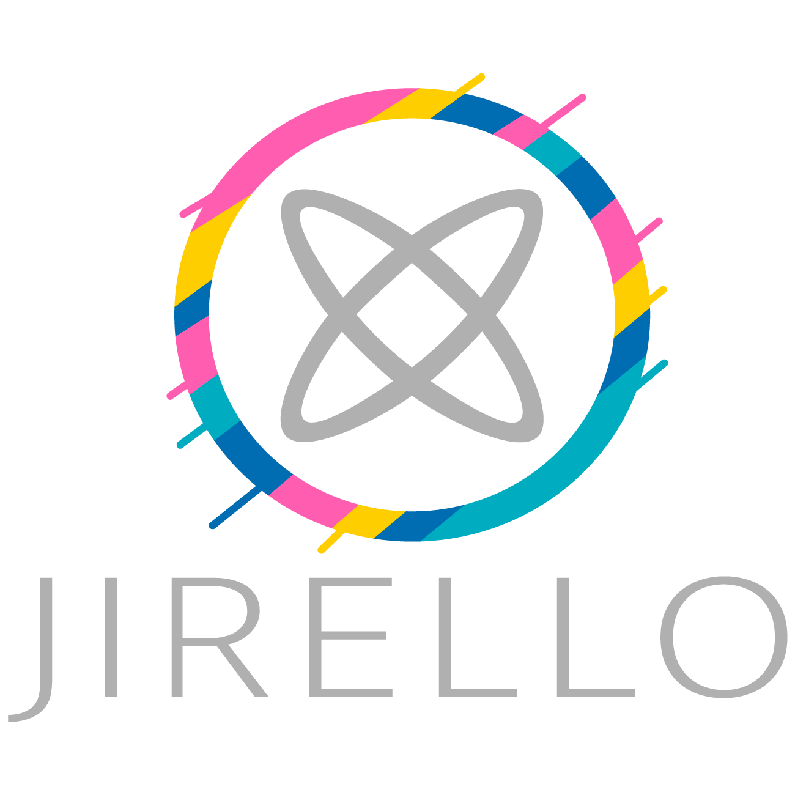

<a name="readme-top"></a>
<!--
*** Thanks for checking out the Best-README-Template. If you have a suggestion
*** that would make this better, please fork the repo and create a pull request
*** or simply open an issue with the tag "enhancement".
*** Don't forget to give the project a star!
*** Thanks again! Now go create something AMAZING! :D
-->


<!-- PROJECT SHIELDS -->
<!--
*** I'm using markdown "reference style" links for readability.
*** Reference links are enclosed in brackets [ ] instead of parentheses ( ).
*** See the bottom of this document for the declaration of the reference variables
*** for contributors-url, forks-url, etc. This is an optional, concise syntax you may use.
*** https://www.markdownguide.org/basic-syntax/#reference-style-links
-->


<!-- PROJECT LOGO -->
<br />
<div align="center">
  <a href="https://github.com/FeNix784/Trello">
    
  </a>


  <p align="center">
    Доска для Agile методологий
    <!-- <br />
    <a href="https://github.com/othneildrew/Best-README-Template"><strong>Explore the docs »</strong></a>
    <br />
    <br />
    <a href="https://github.com/othneildrew/Best-README-Template">View Demo</a>
    ·
    <a href="https://github.com/othneildrew/Best-README-Template/issues">Report Bug</a>
    ·
    <a href="https://github.com/othneildrew/Best-README-Template/issues">Request Feature</a>-->
  </p> 
</div>


<!-- TABLE OF CONTENTS 
<details>
  <summary>Table of Contents</summary>
  <ol>
    <li>
      <a href="#about-the-project">О проектеt</a>
      <ul>
        <li><a href="#built-with">Built With</a></li>
      </ul>
    </li>
    <li>
      <a href="#getting-started">Getting Started</a>
      <ul>
        <li><a href="#prerequisites">Prerequisites</a></li>
        <li><a href="#installation">Installation</a></li>
      </ul>
    </li>
    <li><a href="#usage">Usage</a></li>
    <li><a href="#roadmap">Roadmap</a></li>
    <li><a href="#contributing">Contributing</a></li>
    <li><a href="#license">License</a></li>
    <li><a href="#contact">Contact</a></li>
    <li><a href="#acknowledgments">Acknowledgments</a></li>
  </ol>
</details>
-->


<!-- ABOUT THE PROJECT 


[![Product Name Screen Shot][product-screenshot]](https://example.com)-->

## О проекте

Данный проект представляет собой программную реализацию системы, которая осуществялет гибкое управление проектами путем командного взаимодействия.

Основными гибкими методологиями принято считать Scrum и Kanban. Их целями принято считать получение готового качественного продукта вовремя.

Данный проект визуализирует процессы, чтобы они были у команды на виду. Для этого используют так называемую доску и прикрепленные к ней карточки или стикеры.

Доска является обязательным элементом гибких методологий. Каждый член команды имеет к ней доступ и видит, на каком этапе находится та или иная задача. Она содержит в себе разделы(колонки), в которых находятся карточки задач.
Карточка содержит в себе трактовку, описание, тип, исполнителей, комментарии задачи и движется по потоку перетекая в другие столбцы в зависимости от их состояния.

Главная цель проекта создать систему, которая позволит визуализировать процесс разработки, чтобы каждый участник проекта видел картину целиком и корректировал отдельные ее части, понимая, как его изменения затронут весь проект.


<p align="right">(<a href="#readme-top">↑ Наверх</a>)</p>


### Основные технологии

В данном проекте использовались следующие технологии:

<!-- * [![Next][Next.js]][Next-url] 
* [![Vue][Vue.js]][Vue-url]
* [![Angular][Angular.io]][Angular-url]
* [![Svelte][Svelte.dev]][Svelte-url]
* [![Laravel][Laravel.com]][Laravel-url]
* [![Bootstrap][Bootstrap.com]][Bootstrap-url]
* [![JQuery][JQuery.com]][JQuery-url] -->

Front-end:
* [![React][React.js]][React-url]
* [![React-Query][React-Query]][React-Query-url]
* [![React-Router][React-Router]][React-Router-url]
* [![Axios][Axios]][Axios-url]
* [![Zustand][Zustand]][Zustand-url]
* [![Tailwind][Tailwind]][Tailwind-url]
Back-end:
* [![Java][Java]][Java-url]
* [![Quarkus][Quarkus]][Quarkus-url]
* [![PostgreSQL][PostgreSQL]][PostgreSQL-url]
* [![Hibernate][hibernate]][hibernate-url]
* [![Lombok][Lombok]][Lombok-url]
* [![GSON][GSON]][Gson-url]
* [![H2][H2]][H2-url]
Common:
* [![YandexID][YandexID]][YandexID-url]
* [![Docker][docker]][docker-url]
* [![Swagger][swagger]][swagger-url]
* [![Postman][postman]][postman-url]
* [![GitHub][github]][github-url]


<p align="right">(<a href="#readme-top">↑ Наверх</a>)</p>


<!-- GETTING STARTED -->
## Быстрый старт
Этот проект использует Quarkus, сверхзвуковой субатомный фреймворк Java. Если вы хотите узнать больше о Quarkus'е посетите их вебсайт https://quarkus.io/ .

Чтобы запустить этот проект вам необходимо:

### Предустановочный процесс

1. Создать изображение содержащее базу данных путем вызова указанной команды из папки с файлом `docker-compose.yml`
* npm
  ```sh
  docker-compose up --build
  ```

2. Клонируйте репозиторий
   ```sh
   git clone https://github.com/FeNix784/Trello.git
   ```
3. Введите свои настройки `application.properties`

4. Соберите и запустите проект

Вы можете запустить ваше приложение в режиме разработки, который поддерживает live-coding используя:

```shell script
./mvnw compile quarkus:dev
```

> **_Замечание:_**  Quarkus теперь поставляется с пользовательским интерфейсом разработчика, который доступен в режиме разработки только на http://localhost:8080/q/dev /.

##№ Упаковка и запуск приложения

Приложение может быть упаковано с помощью:

```shell script
./mvnw package
```

Это производит `quarkus-run.jar ` файл в каталоге `target/quarkus-app/`.

Приложение теперь доступно для запуска с использованием `java -jar target/quarkus-app/quarkus-run.jar `.


<p align="right">(<a href="#readme-top">↑ Наверх</a>)</p>


<!-- USAGE EXAMPLES -->
## Использование

Данный проект позволяет применить принципы гибкой разработки программного обеспечения и бережливого управления к различным процессам управления, в частности к разработке продуктов и управлению проектами.
<p align="right">(<a href="#readme-top">↑ Наверх</a>)</p>


<!-- ROADMAP 
## Roadmap

- [x] Add Changelog
- [x] Add back to top links
- [ ] Add Additional Templates w/ Examples
- [ ] Add "components" document to easily copy & paste sections of the readme
- [ ] Multi-language Support
    - [ ] Chinese
    - [ ] Spanish

See the [open issues](https://github.com/othneildrew/Best-README-Template/issues) for a full list of proposed features (and known issues).

<p align="right">(<a href="#readme-top">↑ Наверх</a>)</p>-->


<!-- CONTRIBUTING 
## Contributing

Contributions are what make the open source community such an amazing place to learn, inspire, and create. Any contributions you make are **greatly appreciated**.

If you have a suggestion that would make this better, please fork the repo and create a pull request. You can also simply open an issue with the tag "enhancement".
Don't forget to give the project a star! Thanks again!

1. Fork the Project
2. Create your Feature Branch (`git checkout -b feature/AmazingFeature`)
3. Commit your Changes (`git commit -m 'Add some AmazingFeature'`)
4. Push to the Branch (`git push origin feature/AmazingFeature`)
5. Open a Pull Request

<p align="right">(<a href="#readme-top">↑ Наверх</a>)</p>-->


<!-- LICENSE 
## License

Distributed under the MIT License. See `LICENSE.txt` for more information.

<p align="right">(<a href="#readme-top">↑ Наверх</a>)</p>-->


<!-- CONTACT -->
## Авторы

- [Бусуек Евгений](https://github.com/EugeneBUSUEK)
- [Гришучков Данила](https://github.com/grishuchkov)
- [Зайцев Егор](https://github.com/Papugaicheg)
- [Назаров Никита](https://github.com/luvlaceeeee)
- [Ткачев Даниил](https://github.com/FeNix784)

Project Link: [https://github.com/FeNix784/Trello](https://github.com/FeNix784/Trello)

<p align="right">(<a href="#readme-top">↑ Наверх</a>)</p>


<!-- ACKNOWLEDGMENTS 
## Acknowledgments

Use this space to list resources you find helpful and would like to give credit to. I've included a few of my favorites to kick things off!

* [Choose an Open Source License](https://choosealicense.com)
* [GitHub Emoji Cheat Sheet](https://www.webpagefx.com/tools/emoji-cheat-sheet)
* [Malven's Flexbox Cheatsheet](https://flexbox.malven.co/)
* [Malven's Grid Cheatsheet](https://grid.malven.co/)
* [Img Shields](https://shields.io)
* [GitHub Pages](https://pages.github.com)
* [Font Awesome](https://fontawesome.com)
* [React Icons](https://react-icons.github.io/react-icons/search)

<p align="right">(<a href="#readme-top">↑ Наверх</a>)</p>-->


<!-- MARKDOWN LINKS & IMAGES -->
<!-- https://www.markdownguide.org/basic-syntax/#reference-style-links -->

[React.js]: https://img.shields.io/badge/React-20232A?style=for-the-badge&logo=react&logoColor=61DAFB
[React-url]: https://reactjs.org/
[React-Query]: images/reactQuery.png
[React-Query-url]: https://github.com/Xadeka/react-query
[React-Router]: images/reactRouter.png
[React-Router-url]:https://reactrouter.com/en/main
[Axios]: images/axios.png
[Axios-url]:https://axios-http.com/
[Tailwind]: images/tailwind.png
[Tailwind-url]:https://tailwindcss.com/
[Zustand]: images/zustand.png
[Zustand-url]:https://github.com/pmndrs/zustand

[Java]: https://img.shields.io/badge/java-%23ED8B00.svg?&style=for-the-badge&logo=java&logoColor=white
[Java-url]:https://www.java.com
[Quarkus]: images/quarkus.png
[Quarkus-url]:https://quarkus.io/
[Lombok]: images/lombok.png
[Lombok-url]:https://projectlombok.org/
[GSON]: images/google.png
[Gson-url]:https://www.sites.google.com/site/gson/gson-user-guide
[YandexID]: images/ya_id_.png
[YandexID-url]:https://yandex.ru/dev/id/doc/ru/
[PostgreSQL]: https://img.shields.io/badge/postgres-%23316192.svg?&style=for-the-badge&logo=postgresql&logoColor=white
[PostgreSQL-url]:https://www.postgresql.org/
[H2]: images/H2_logo.png
[H2-url]: https://ru.wikipedia.org/wiki/H2
[docker]: https://img.shields.io/badge/docker%20-%230db7ed.svg?&style=for-the-badge&logo=docker&logoColor=white
[docker-url]:https://www.docker.com/
[swagger]: images/swagger.png
[swagger-url]:https://swagger.io/
[postman]: images/postman.png
[postman-url]:https://www.postman.com/
[github]: https://img.shields.io/badge/github%20-%23121011.svg?&style=for-the-badge&logo=github&logoColor=white
[github-url]:https://github.com/
[hibernate]: images/hibernate.png
[hibernate-url]:https://hibernate.org/

